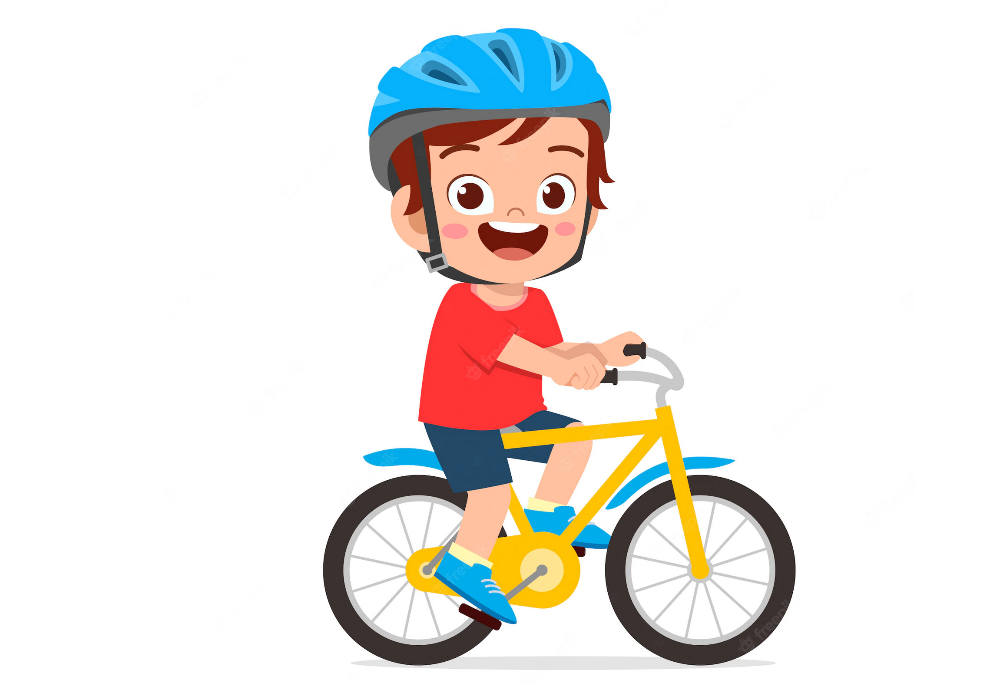
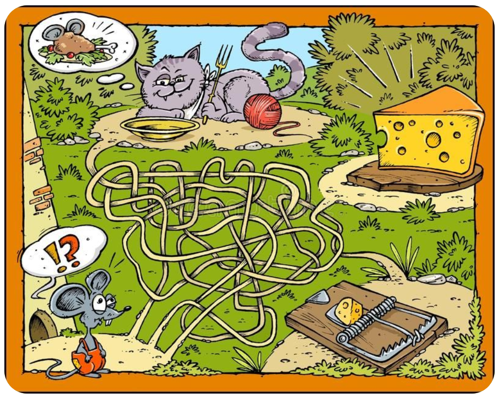

#  O epistemologii

## Co je epistemologie?

Věda zkoumající poznání / teorie poznání

- *Epistémé* - znalost, vědění
- *Logos* - věda, výzkum

K základním otázkám patří:
- *„Co víme?“*
- *„Co to znamená říci, že něco víme?“*
- *„Jak víme, že víme?"*
- *„Na čem stojí naše přesvědčení?“*

Zahrnuje informační gramotnost, kritické myšlení

## Historie

Plato, 400 př. n. l.

## Důležitost epistemologie

S informační dobou a demokratickou společností se stala extrémně důležitým oborem.

- Jak rozlišíme, co je pravda a co nepravda?
- Jak zajistit, abychom věřili pravdivým věcem?
- Jak vést dialog s lidmi s opačným názorem?
- Jak tvarovat demokratickou společnost, aby sloužila našim zájmům?

## Dnešní situace

**Velká část populace má nepravdivé názory.** To je problém v demokratické společnosti.

Otázka | Ano | Ne
---|---|---
Do you accept Joe Biden as having legitimately won the 2020 presidential election? [\[ref\]](https://www.surveymonkey.com/curiosity/axios-january-6-revisited/) | 55% | 26%
Myslíte, že změna klimatu je způsobena převážně činností člověka? [\[ref\]](https://climatecommunication.yale.edu/wp-content/uploads/2021/06/international-climate-opinion-february-2021d.pdf) | 46% | 50%
Věříte v účinnost akupunktury či akupresury? [\[ref\]](https://www.seznamzpravy.cz/clanek/podle-pruzkumu-veri-v-boha-petina-lidi-v-cesku-a-ve-vyssi-moc-35-procent-lidi-179551) | ~70% | ~30%

> Tato tabulka potřebuje vylepšit

Rozsáhlý průzkum ohledně náboženství a spirituality: [\[ref\]](https://www.cemucesiveri.cz/)

V každé ano/ne otázce může mít jen jedna strana pravdu, ta druhá se mýlí. Změna klimatu buď je převážně způsobena činností člověka, nebo není. Výsledek voleb v USA v r. 2020 buď byl legitimní, nebo nebyl.

Z každého názoru plynou důležité následky:

* Co se stane, pokud 26% lidí v USA bude chtít svrhnout legitimní vládu protože jsou přesvědčeni, že byla dosazena podvodem?
* Co když byla vláda v USA opravdu dosazena podvodem, ale většina lidí v USA je přesvědčena o opaku?

----

* Co když globální oteplování způsobí katastrofu kvůli tomu, že většina lidí si myslela, že GO neexistuje?
* Co když GO neexistuje, ale lidstvo stejně vynaloží nesmírné prostředky na omezení emisí?

## Epistemologie není intuitivní

Nelze se spolehlivě dobrat pravdy pouhým hledáním informací. Neplatí, že čím informovanější člověk je, tím více jsou jeho názory pravdivé.

Hledání pravdy není jako jízda na kole. Ať se učíte jízdu na kole jakkoliv, pravděpodobně se v jízdě časem zlepšíte.

*[^ ref](https://www.freepik.com/premium-vector/happy-cute-kid-boy-riding-bike-smile_6192700.htm)*

Hledání pravdy je spíše jako procházení nebezpečného bludiště. Je snadné chytit se do nástrahy pokud nevíte jak spolehlivě poznat správnou cestu. Navíc, správná cesta není často očividná, a vydat se po ní může být nepříjemné.

*[^ ref](https://www.pinterest.com/pin/548242954641988846/)*

Hlavním cílem tohoto kurzu je naučit se poznat správnou cestu k pravdě.
